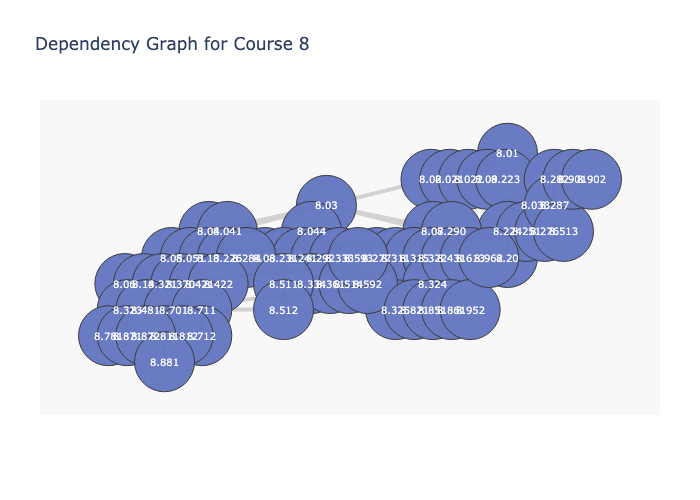

## **Creating Graphs for MIT Classes**

In this project I created dependency graphs for the classes in the majors at MIT, like the one shown below for MIT's Physics Major

These graphs are stored as HTML files, and when users hover over a bubble they can see the full class name for the course number. When users click on a class, a new tab with the full class description opens.

The aim is to eventually create a web application for users to select a major and then see the corresponding dependency graph for that major.

Some simplifications were made to this model. Some classes in a major depend on classes outside of that major. For example
8.04 Quantum Physics I (a physics course) is dependent on 18.03 Differential Equations (a math course). Those dependencies were
ignored for visual simplicity. Also, some more advanced classes only require "permission of instructor." Those classes were also ignored
because they are not taken by the average undergraduate at MIT and also have no implementable dependency.

The graphs vary in usefulness. For some majors, almost all of the classes have no prereqs or only require instructor permission. I completely excluded Course 21 for this reason, it's graph was essentially empty. I also didn' include Course 3: Materials Science, since many classes have prereqs that don't exist. 

Hope you enjoy!